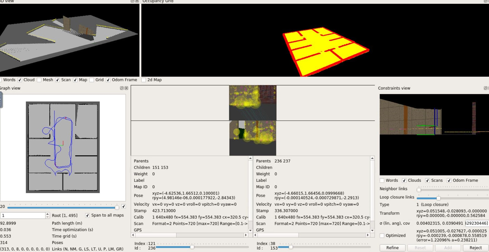
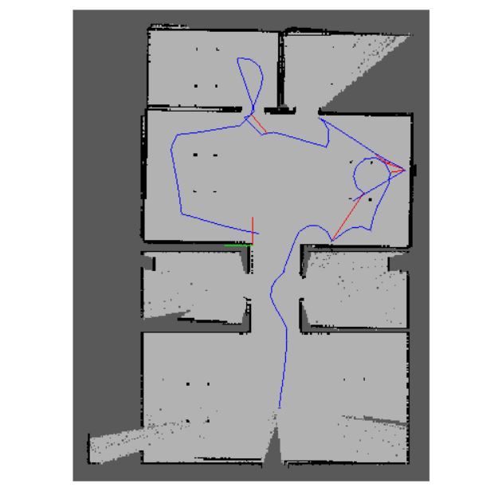
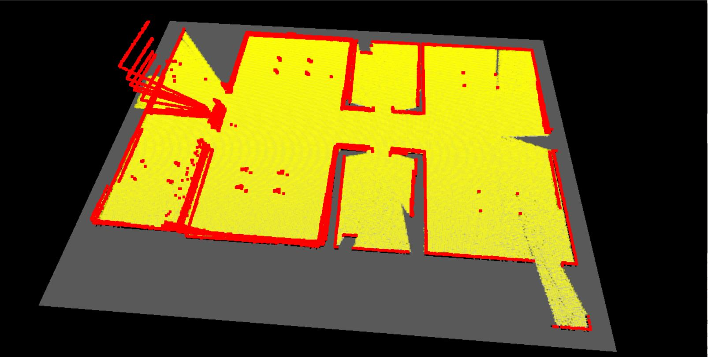
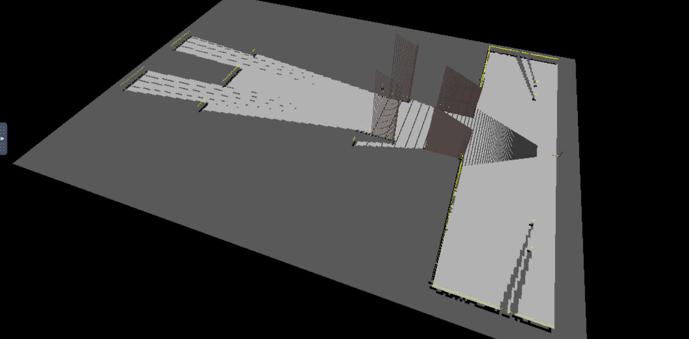
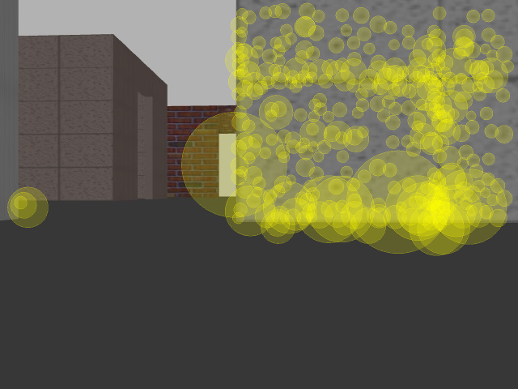
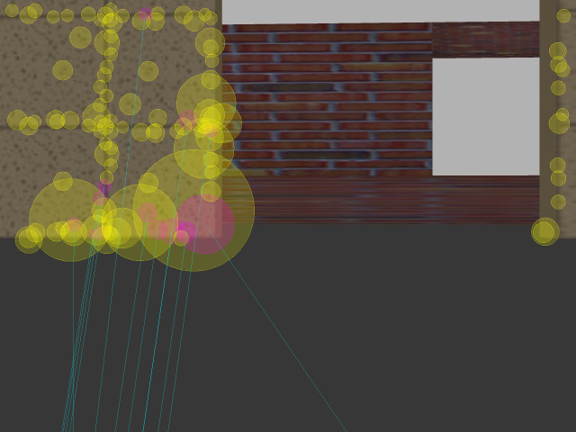

# Map my world Project
In this project the robot was moved around the project world usig the "teleop_twist_keyboard" package. Using the RTAB-Map package it could map the world. 
The Database could not be uploaded to the repository, therefore the lind is to download it from the cloud.
[RTABMAP-Database download link](https://drive.google.com/file/d/1NUu7nIIrdr3Q0gBXKpTGTA_ZNb_Zr6nH/view?usp=sharing)

However, the following photos demonstrate the path taken to create the map of the Gazebo world. The rtabmap "DatabaseViewer" was used to show the results.

#### Entire window

#### Graph view

#### Occupency grid

#### 3D view

#### Detected features

