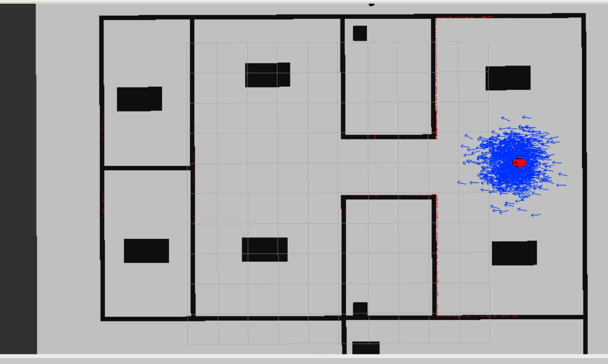
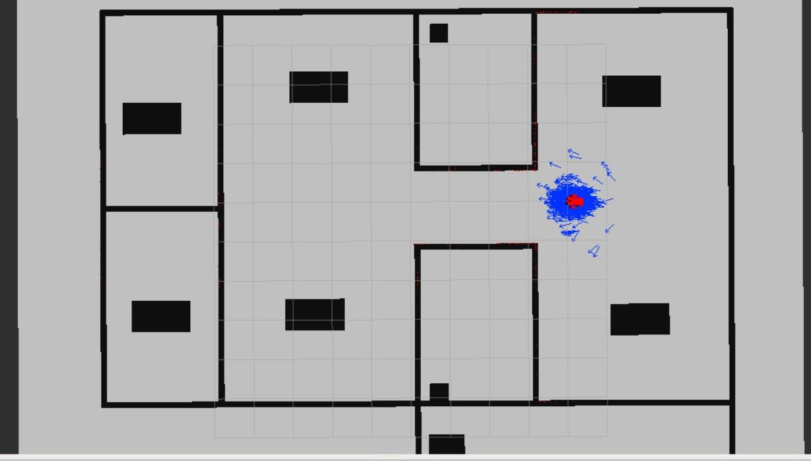
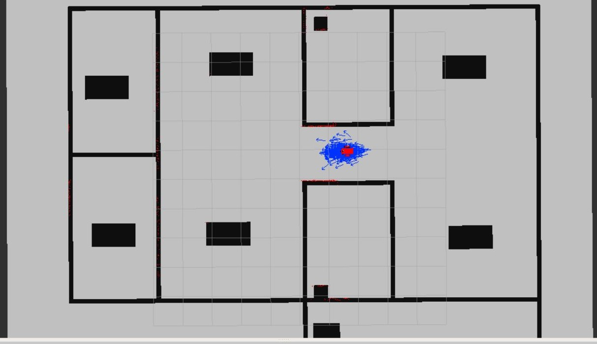
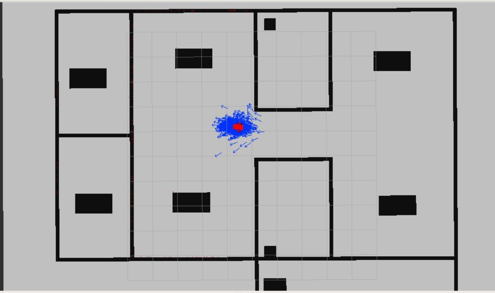
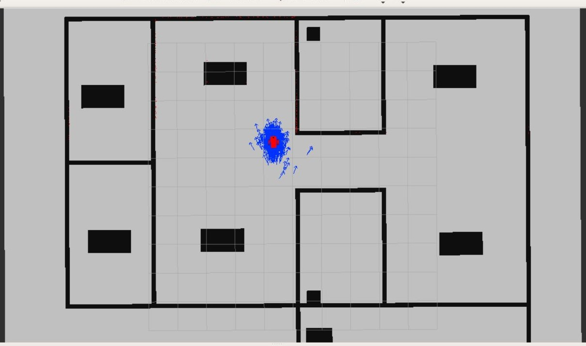
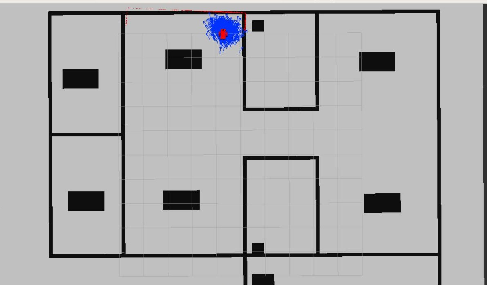

# Where Am I Project
In the project the sensor parameters and the model parameters are tuned trying to achieve the best results.
The following photos are screenshots for the simulation results in Rviz.

#### Initial Status

#### Moving steps

