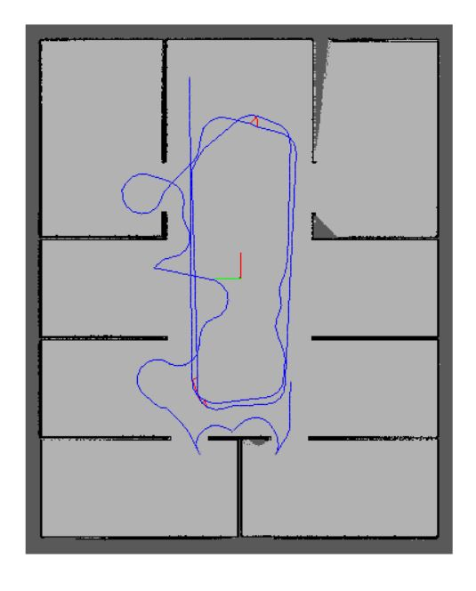
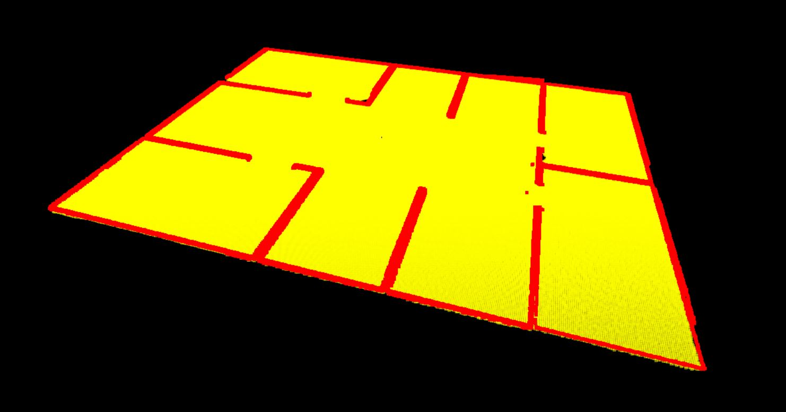
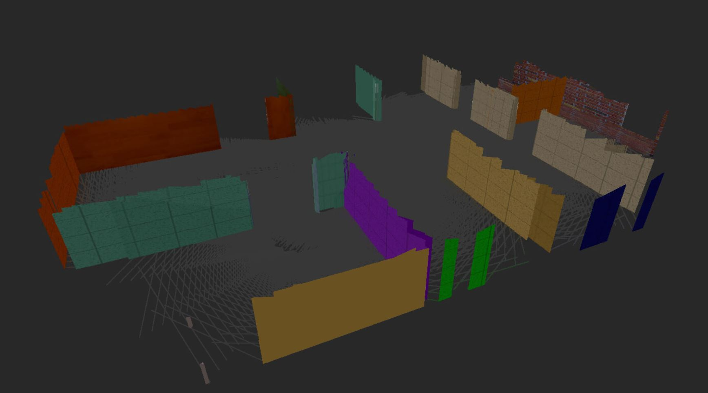
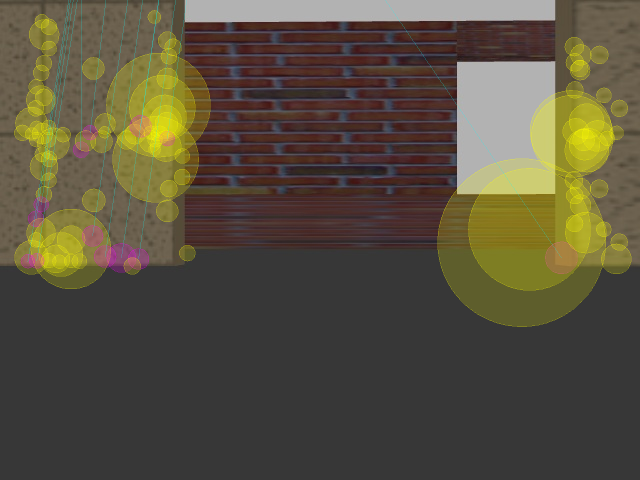

# Map my world Project
In this project the robot was moved around the project world usig the "teleop_twist_keyboard" package. Using the RTAB-Map package it could map the world. The following photos demonstrate the path taken to create the map of the Gazebo world. The rtabmap "DatabaseViewer" was used to show the results.

#### Entire window

#### Graph view

#### Occupency grid

#### 3D view

#### Detected features

